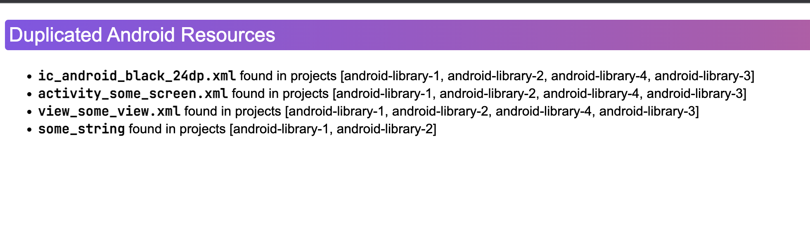

# __Doppler__

---
Gradle plugin, which detects & reports about duplicated resources in <code>Android</code> projects.



### Features
- Easy configuration
- Exclude projects, sourceSets, concrete resources from plugin checks
- Html, Txt, Console reports

### Quick start

#### with Gradle

```kotlin
plugins {
    id("me.lounah.doppler").version("[version]")
}

repositories {
    mavenCentral()
}

doppler {
    exclude {
        resources("shared_excluded_resource.xml")
        sourceSets("androidTest")
        projects("android-library-4")
    }
    report {
        html()
    }
}
```
And then

```shell
./gradlew :android-application:doppler
```